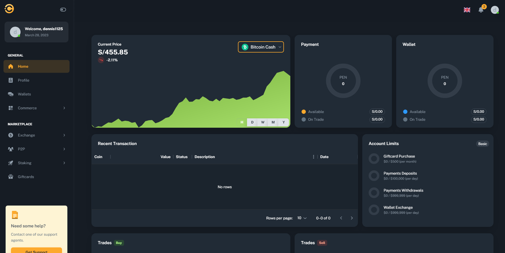
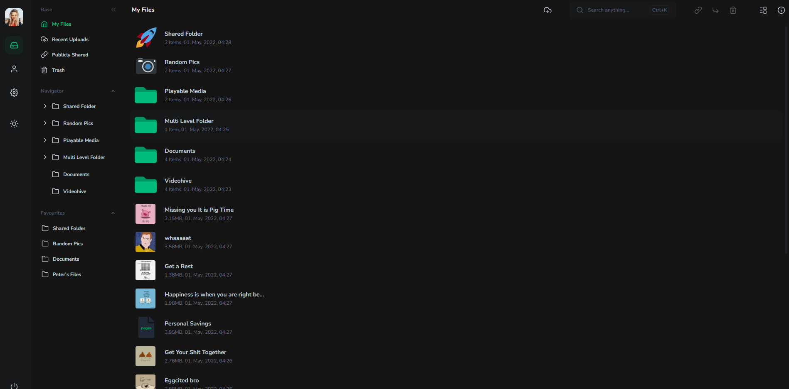
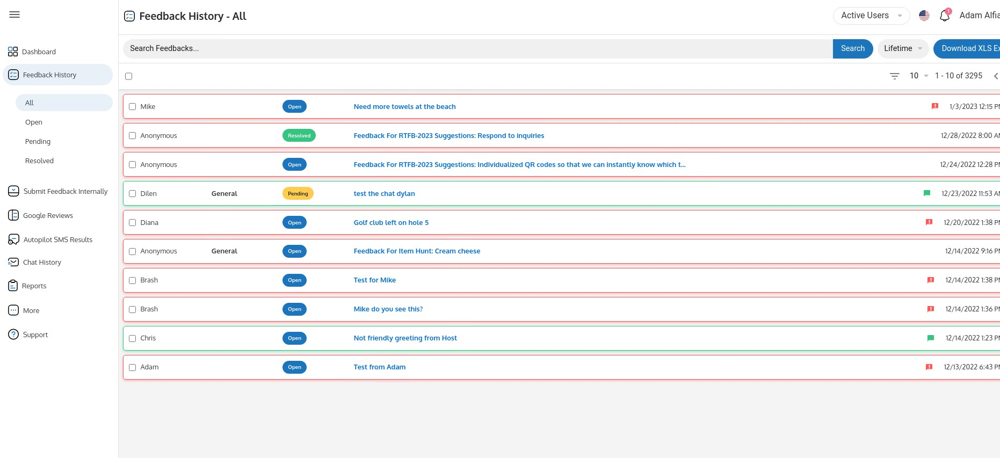
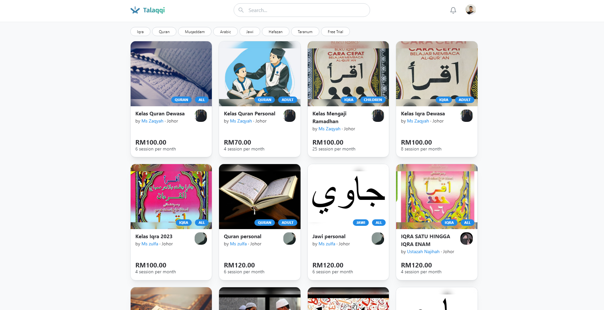

# Hi there!  I am Dennis Stephens from Canada.

##  About Me

I have been working as a Web Developer for 6 years in both Front-end and Back-end web
development. Also I have good experience in Blockchain and solidity.
As a problem solver who loves facing challenges in my work, I'm excited to be at the deployment
phase of my career as a web developer. I'm passionate and ambitious about my work, and love to
be on a team that questions possibilities. I am looking for a new job opportunity in Full stack
development. I will work harder with all my ability and knowledge for the company.
Congratulations!
 

##  My best projects in private repositories

Click images to view the loom video. ❤💚💙 

 
<table>
  <tr>
    <td></td>
    <td></td>
  </tr>
  <tr>
    <td></td>
    <td></td>
  </tr>
  
  
  
  
</table>

